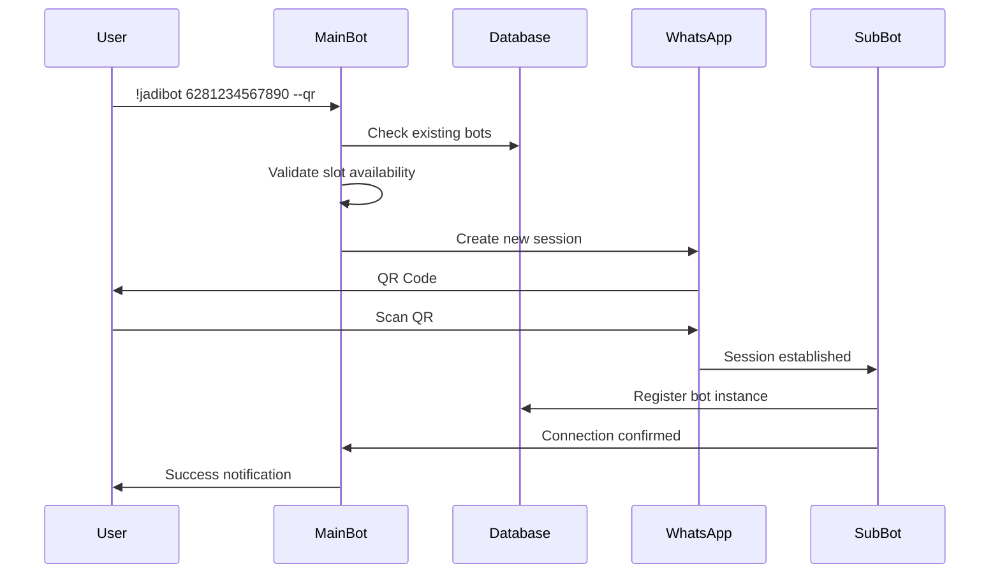
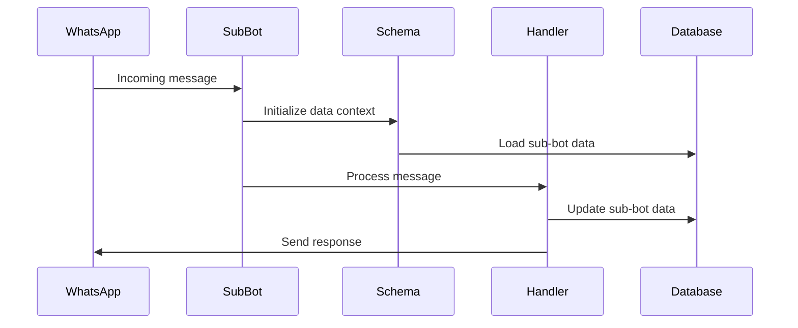

# System Architecture

This document explains the architecture and design principles of the multi-user bot system.

## 🏗️ Overview

The multi-user bot system allows multiple users to create their own WhatsApp bot instances (sub-bots) that operate independently while sharing the same core infrastructure. Each sub-bot has its own WhatsApp session, data context, and user base.

## 📊 High-Level Architecture

```
┌─────────────────────────────────────────────────────────────┐
│                     Main Bot Infrastructure                  │
├─────────────────────────────────────────────────────────────┤
│  ┌─────────────┐  ┌─────────────┐  ┌─────────────┐         │
│  │   Sub-Bot   │  │   Sub-Bot   │  │   Sub-Bot   │  ...    │
│  │     #1      │  │     #2      │  │     #3      │         │
│  ├─────────────┤  ├─────────────┤  ├─────────────┤         │
│  │ Session #1  │  │ Session #2  │  │ Session #3  │         │
│  │ Data #1     │  │ Data #2     │  │ Data #3     │         │
│  │ Users #1    │  │ Users #2    │  │ Users #3    │         │
│  └─────────────┘  └─────────────┘  └─────────────┘         │
├─────────────────────────────────────────────────────────────┤
│                   Shared Components                         │
│  ┌─────────────────────────────────────────────────────────┐ │
│  │ Bot Manager │ Connector │ Listener │ Schema │ Database │ │
│  └─────────────────────────────────────────────────────────┘ │
└─────────────────────────────────────────────────────────────┘
```

## 🧩 Core Components

### 1. Main Bot Infrastructure

The main bot serves as the host and orchestrator for all sub-bot instances:

- **Role**: Creates and manages sub-bot instances
- **Authentication**: Handles user requests for bot creation
- **Coordination**: Manages inter-bot communication and conflicts
- **Administration**: Provides oversight and termination capabilities

### 2. Sub-Bot Instances

Each sub-bot is an independent WhatsApp bot instance:

- **Isolation**: Own WhatsApp session and phone number
- **Data Context**: Separate user, group, and chat databases
- **Autonomy**: Independent message processing and responses
- **Limitations**: Restricted permissions (no owner privileges)

### 3. Session Management

Each bot maintains its own WhatsApp session:

```javascript
// Session structure
{
  jid: "6281234567890@s.whatsapp.net",
  session_path: "./sessions/6281234567890",
  auth_state: {...},
  connection_state: "open|connecting|close"
}
```

### 4. Data Isolation

Each sub-bot has its own data context:

```javascript
// Main bot data context
global.db = {
  users: [...],      // Main bot users
  groups: [...],     // Main bot groups
  chats: [...],      // Main bot chats
  bots: [...]        // Registry of all sub-bots
}

// Sub-bot data context
findJid.bot(clientJid).data = {
  users: [...],      // Sub-bot specific users
  groups: [...],     // Sub-bot specific groups
  chats: [...]       // Sub-bot specific chats
}
```

## 🔄 Data Flow

### Bot Creation Flow



### Message Processing Flow



## 🗃️ Database Structure

### Bot Registry
```javascript
global.db.bots = [
  {
    _id: "encrypted_key",
    jid: "6281234567890@s.whatsapp.net",
    sender: "6280987654321@s.whatsapp.net",
    last_connect: 1640995200000,
    is_connected: true,
    stop: false,
    is_new: true,
    method: "--qr",
    data: {
      users: [...],
      groups: [...],
      chats: [...],
      setting: {...}
    }
  }
]
```

### Data Isolation Mechanism
```javascript
// JID Helper determines context
const { hostJid, clientJid, findJid } = JID(client)

// Data context selection
let data = !hostJid && findJid.bot(clientJid) 
  ? findJid.bot(clientJid).data  // Sub-bot context
  : global.db                    // Main bot context
```

## 🔐 Security Model

### Permission Hierarchy
1. **System Owner**: Can manage all bots and system settings
2. **Sub-Bot Owner**: Can manage only their own bot instance
3. **Sub-Bot Users**: Can use bot features but cannot manage the bot

### Security Measures
- **Owner Verification**: Sub-bot users cannot become system owners
- **Group Isolation**: Main bot and sub-bots cannot coexist in same groups
- **Session Security**: Each bot has encrypted session storage
- **Command Restrictions**: Limited access to management commands

## 🔌 Connection Management

### Instance Manager
The Instance Manager maintains active bot connections:

```javascript
Instance.setBot(jid, client)     // Register bot instance
Instance.getBot(jid)             // Retrieve bot instance
Instance.delBot(jid)             // Remove bot instance
Instance.getData(jid)            // Get bot metadata
```

### Auto-Reconnection System
```javascript
// Reconnection flow
1. System restart detected
2. Load all bots from database
3. Filter disconnected bots
4. Create new Baileys instances
5. Restore sessions from storage
6. Register event listeners
7. Update connection status
```

## 🌐 Web Interface Architecture

### API Layer
```
/api/subbot/connect  → Bot connection endpoint
/api/subbot/status   → Bot status checking
/api/subbot/list     → List all bots
```

### Frontend Components
- **Landing Page**: Bot creation interface
- **Connection Page**: QR/Pairing code display
- **Dashboard**: Bot management and analytics

## 📡 Event System

### Event Registration
Each sub-bot registers its own event handlers:

```javascript
client.register('message', messageHandler)
client.register('group.add', welcomeHandler)
client.register('message.delete', antideleteHandler)
```

### Event Isolation
Events are processed within the correct data context:
- Message events use sub-bot's user/group data
- Group events affect only sub-bot's group settings
- System events may affect global state

## 🔄 Lifecycle Management

### Bot Creation Lifecycle
1. **Request Validation**: Check phone number and slots
2. **Session Creation**: Initialize WhatsApp session
3. **Authentication**: Handle QR/pairing process
4. **Registration**: Add to bot registry
5. **Event Binding**: Attach event listeners
6. **Confirmation**: Notify user of success

### Bot Termination Lifecycle
1. **Authorization**: Verify termination permissions
2. **Session Cleanup**: Logout WhatsApp session
3. **File Cleanup**: Remove session files
4. **Database Cleanup**: Remove from bot registry
5. **Instance Cleanup**: Remove from Instance manager

## 📊 Performance Considerations

### Resource Management
- **Memory**: Each bot instance uses additional memory
- **Storage**: Session files accumulate over time
- **Network**: Multiple concurrent WhatsApp connections
- **CPU**: Message processing scales with bot count

### Optimization Strategies
- **Session Compression**: Minimize session file sizes
- **Database Indexing**: Optimize bot lookups
- **Event Batching**: Group similar operations
- **Resource Limits**: Implement slot limits and quotas

## 🔧 Configuration System

### Environment-Based Configuration
```javascript
bot_hosting: {
  server: boolean,      // Enable web server
  slot: number,         // Maximum bot instances
  session_dir: string,  // Session storage directory
  delay: number,        // Request delays
  interval: number      // Cleanup intervals
}
```

### Runtime Configuration
- **Dynamic Slot Adjustment**: Change limits without restart
- **Feature Toggles**: Enable/disable functionality
- **Resource Monitoring**: Track usage and performance

## 🚀 Scalability Architecture

### Horizontal Scaling
- **Multiple Hosts**: Distribute bots across servers
- **Load Balancing**: Route connections efficiently
- **Shared Database**: Centralized bot registry

### Vertical Scaling
- **Resource Limits**: CPU and memory quotas per bot
- **Connection Pooling**: Reuse database connections
- **Caching**: Reduce database queries

This architecture provides a robust, scalable foundation for multi-user bot functionality while maintaining security, isolation, and performance.